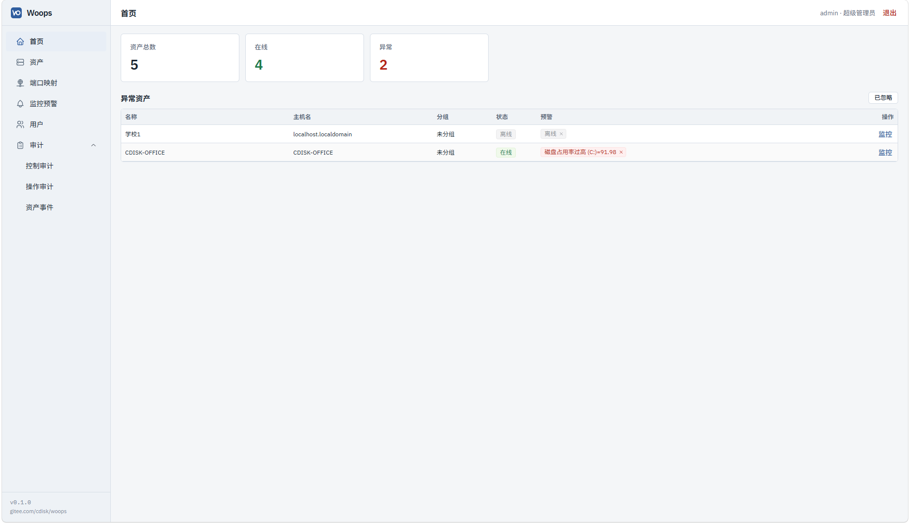
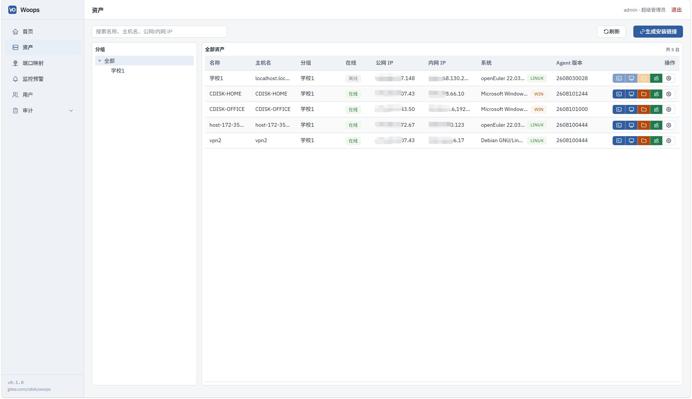
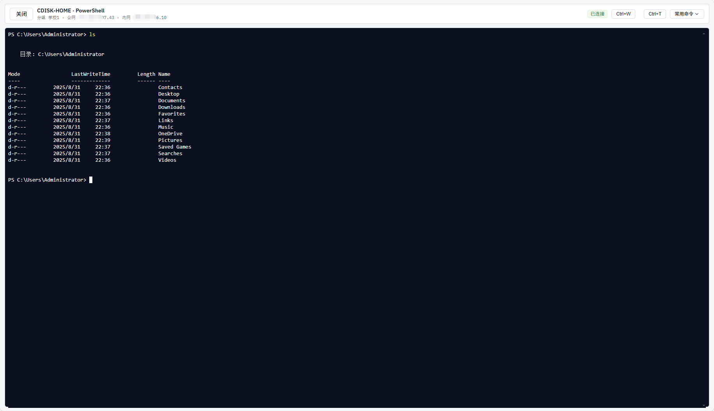
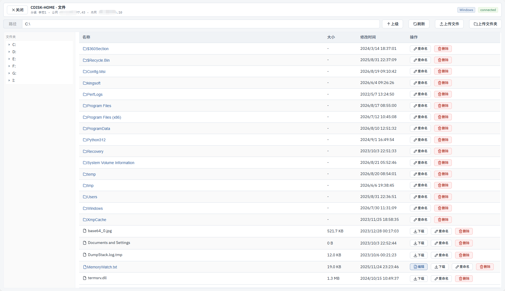
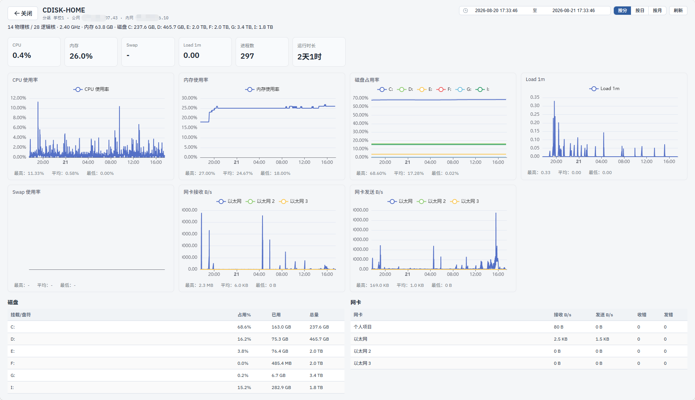
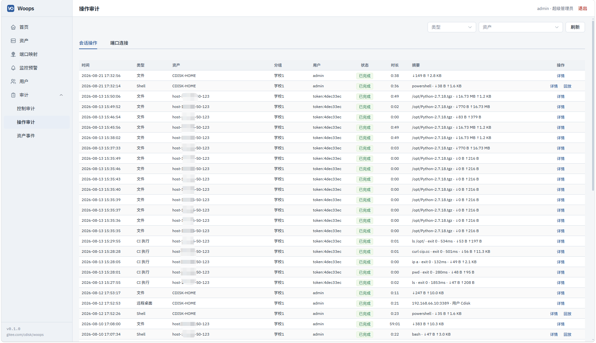
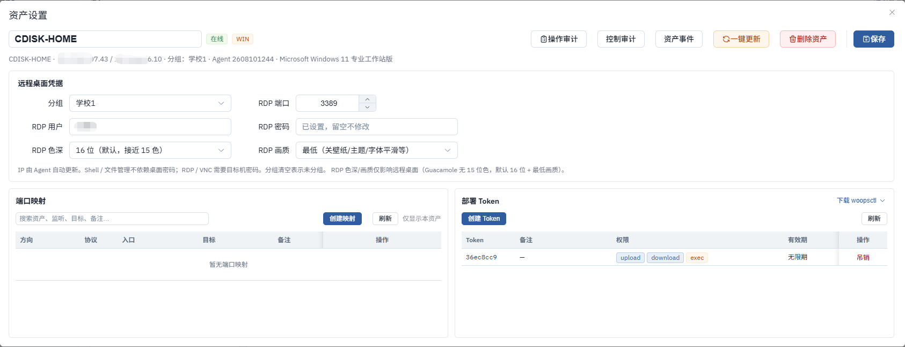

# Woops

出站 Agent 统一运维通道：多机房 / 网闸后主机只需能访问 Gateway，**不必**先把堡垒打进内网。

Shell · 文件 · RDP/VNC · 端口映射 · 轻量监控 · 审计回放 · GitLab CI（woopsctl）走**同一条 Agent 通道**。
控制面 Java，数据面 Go Gateway/Agent，控制台 Vue 3。

功能与架构约定见 [`FEATURES.md`](./FEATURES.md)。许可证：[Apache License 2.0](./LICENSE)。

## ▶ 在线演示

**[woops-demo.tool4dev.net](https://woops-demo.tool4dev.net/demo/)** — 免注册、免密码，点一下按钮直接进控制台。

进去就是管理员，四台一次性 Linux 主机已经在线：开 Shell、管文件、改端口映射、看监控曲线、再从审计日志里回放自己刚才的会话。环境整点自动重置，随便折腾；但账号是所有人共用的，**别上传真实数据或密钥**。

## 和 JumpServer / Teleport 的差别（一句话）

| | 传统堡垒（如 JumpServer） | Woops |
|--|--------------------------|--------|
| 网络假设 | 中心能连到资产（不通就要 FRP/跳板） | **资产 Agent 出站**连 Gateway |
| 目标 | 会话与权限 | 会话 + 轻监控 + **CI 复用同一通道** |
| 目标侧 | 通常依赖 sshd 等 | Agent 原生 Shell/文件（不依赖 sshd） |

Teleport 也是出站隧道模型，偏零信任大平台；Woops 更偏「少装几套、一键装完能干活」的运维面板。

## 网闸与多级内网（Agent 自带受限 proxy）

传统堡垒要「中心能拨到资产」；Woops 反过来：**每台资产上的 Agent 只出站**连 Gateway（HTTPS / WSS）。防火墙可以挡住从公网打进内网，只要内网里有一台机器能摸到 Gateway（或摸到上一跳代理），更深的机器也能上线。

**不必另装 Squid / nginx 正向代理。** Agent **自带**可选的入站 HTTP 正向代理插件（`agent.yaml` → `proxy.*`），与管控共用一个二进制；默认关闭，打开后仍是**受限**代理，不是开放上网出口：

| 限制 | 说明 |
|------|------|
| 账密强制 | 必须配置 `username` / `password`，无匿名代理 |
| 来源 CIDR | `allowCIDRs` 白名单，只有指定网段能连上代理端口 |
| 默认只通 ops | `allowGlobal=false`（默认）时，出站目标仅限 Gateway 等 ops 主机（`gateway` 主机及其端口 / `:9100`），**不能**当通用翻墙或任意网站代理 |
| 可选放开 | 仅当明确设 `allowGlobal=true` 才允许更广目标；仍拒绝 loopback / 云元数据等危险地址 |
| 串联防环 | 本机若已有 `gatewayProxy`，入站流量会经上游再出站，并拒绝连回自身代理，避免环路 |

典型拓扑：

```text
  ┌─ 公网 / DMZ ─┐         防火墙          ┌──────── 内网 ────────┐
  │  Woops       │  ←———— firewall ————→  │  跳板机 A            │
  │  Gateway     │                        │  Agent（开受限 proxy）│
  │  Console …   │                        │         │            │
  └──────────────┘                        │         │ proxy      │
                                          │         ▼            │
                                          │  业务机 B / C …      │
                                          │  Agent（经 A 出站）  │
                                          └──────────────────────┘
```

用一句话对照常见场景：

`互联网上的 Woops（Gateway） ←firewall→ 内网跳板（Agent 自带受限 proxy） ←proxy→ 更深内网（Agent）`

| 角色 | 做什么 |
|------|--------|
| **Gateway（互联网侧）** | 公网可达的 `https`/`wss`；Agent / 安装脚本都连这里 |
| **跳板机 A（能出网或能到 Gateway）** | 正常安装 Agent；在 `agent.yaml` 打开入站 **`proxy.*`**（账密 + `allowCIDRs`；默认只转发到 ops） |
| **更深内网 B** | 安装前设 `https_proxy`/`http_proxy` 指向 **A 的代理**；脚本写入 `gatewayProxy`。之后 B→Gateway 的 WSS 经 A 的受限 proxy 出站 |
| **再深一层 C（只达 B）** | 同理：`https_proxy` 指向 **B**；B 若同时开了 `proxy.*`，且自己带 `gatewayProxy=A`，则链路为 **C → B → A → Gateway** |

要点：

- **不用**再为每层网闸单独搭 FRP / SSH / 第三方正向代理；跳板就是已纳入管控、并打开**受限 proxy** 的 Agent。
- Agent **只出站**，不要求 Gateway 能主动拨进内网。
- 安装与日常上线认同一套代理环境变量；控制台「生成安装链接」弹窗里有 `https_proxy` 写法与密码编码说明。
- 配置示例见 [`go/agent.example.yaml`](./go/agent.example.yaml)（`gatewayProxy`、`proxy.*`）。

## 界面预览

截图在 [`docs/screenshots/`](./docs/screenshots/)（IP 等已打码）。

| 首页 · 异常资产与分组 | 资产列表 · 分组树与会话入口 |
|:---:|:---:|
|  |  |

| Shell（Agent 原生，不依赖 sshd） | 文件管理 |
|:---:|:---:|
|  |  |

| 资产监控 | 操作审计 · 会话回放入口 |
|:---:|:---:|
|  |  |

| 资产设置 · 桌面凭据 / 端口映射 / 部署 Token |
|:---:|
|  |

## 快速开始

两套路：**A. 拉镜像部署**（推荐试用 / 生产服务器，无需 JDK/Go/Node）；**B. 本机编译开发**（改代码时用）。

### A) 用 Docker Hub 镜像启动（推荐）

前置：本机已装 **Docker** + **Docker Compose**，能访问 [Docker Hub](https://hub.docker.com/)（或已配置镜像加速 / 代理）。

```bash
# 1. 克隆仓库（只需 compose、证书脚本与 .env 模板）
git clone https://gitee.com/cdisk/woops.git
cd woops

# 2. 环境变量
cp .env.example .env          # Windows: copy .env.example .env
# 按访问地址改 PUBLIC：
#   OPS_CONSOLE_PUBLIC_HTTP=https://<你的IP或域名>
#   OPS_GATEWAY_PUBLIC_HTTP=https://<同上>:9200
#   OPS_GATEWAY_PUBLIC_WS=wss://<同上>:9200
#   OPS_CONTROL_PUBLIC_HTTP=http://<同上>:9100
# 生产务必改 OPS_JWT_SECRET / OPS_TICKET_SECRET / 管理员密码

# 3. 拉镜像并启动（默认标签 0.1.11；可改 WOOPS_IMAGE_TAG=latest）
#    若 deploy/tls/ 尚无证书，compose 的 tls-init 会按 .env 里 PUBLIC 地址自签，
#    并把匹配的 SPKI pin 写入 deploy/compose-pin.env（覆盖 .env 里空/旧 pin）
docker compose --env-file .env --profile full --profile desktop up -d
```

浏览器打开 `https://<你的地址>`（自签证书需信任一次）。默认账号：`admin` / `admin123`（首次登录须绑定 TOTP）。

**证书说明：** 首次 `up` 前请把 `.env` 的 `OPS_*_PUBLIC_*` 改成实际访问的 IP/域名（自签 SAN 来自这些 URL）。已有公有 CA 或要自定义 SAN 时，可先跑 [`deploy/gen-gateway-tls.sh`](./deploy/gen-gateway-tls.sh) 再 `up`（已有 `gateway.crt`/`gateway.key` 则不会覆盖）。换域名后若浏览器/Agent 校验证书失败，删掉 `deploy/tls/gateway.*` 再 `up` 即可重签。

镜像仓库：[`cdisk/woops-console`](https://hub.docker.com/r/cdisk/woops-console)、[`cdisk/woops-control-api`](https://hub.docker.com/r/cdisk/woops-control-api)、[`cdisk/woops-gateway`](https://hub.docker.com/r/cdisk/woops-gateway)。

| 文件 | 用途 |
|------|------|
| 根目录 [`docker-compose.yml`](./docker-compose.yml) | **拉 Hub 镜像**部署（本小节） |
| [`deploy/docker-compose.yml`](./deploy/docker-compose.yml) | **本机构建**镜像（开发 / 改 Dockerfile 时） |

生产服务器也可把仓库放到 `/opt/ops`，`.env` 参考 [`deploy/env.prod.example`](./deploy/env.prod.example)，证书放 `deploy/tls/`（勿提交）。

接入 Agent：控制台 → **资产** → 选分组 → **生成安装链接**（详见下方 **§4**）。

---

### 0) 环境变量（本机开发必做）

```powershell
# 仓库根目录
copy .env.example .env
# 按本机改 PUBLIC 地址；生产务必改 JWT / Ticket / 管理员密码
```

`.env` / `.env.local` **不要提交**。生产可参考 [`deploy/env.prod.example`](./deploy/env.prod.example)。

### 1) 前置（本机编译）

JDK 21、Maven、Node 20+、Docker（Postgres / 可选 guacd）、OpenSSL（生成自签证书时用）。

**Go（按编译目标区分）：**

| 目标 | 要求 |
|------|------|
| `gateway` / `woopsctl`（本机开发） | **Go 1.22+**（读 `go/go.mod`，当前模块声明 **`go 1.20`** 最低版本） |
| **Windows Agent**（须兼容 Win7–Win11） | 用 [`go/scripts/build-agent-windows.ps1`](./go/scripts/build-agent-windows.ps1)，脚本固定 **`GOTOOLCHAIN=go1.20.14`**；不要单独 `go build` Agent 当发布包 |
| **Linux Agent** | 用 [`go/scripts/build-agent-linux.sh`](./go/scripts/build-agent-linux.sh)，在 **Linux 本机或容器**里编；**勿在 Windows 上 `GOOS=linux` 交叉编译**（曾 segfault） |
| Docker 全栈里的 Gateway 镜像 | [`deploy/Dockerfile.gateway`](./deploy/Dockerfile.gateway) 用 Go 1.26 编 gateway / Linux Agent / woopsctl，**另用 Go 1.20.14 编 Windows Agent**，保证下载到的 EXE 可运行于 Win7 / Server 2012 |

### 1.4) Agent 支持的操作系统

安装以 **amd64** 为主（Windows / Linux）；Linux 安装命令内联 `uname -m` 也可装 **arm64**（Gateway 镜像内两者均有）。

| 平台 | 支持范围 | 安装方式 | Shell / 备注 |
|------|----------|----------|----------------|
| **Linux** | 常见 amd64/arm64 发行版（systemd 服务） | `curl` 下载二进制 + `woops-agent install` | 原生 PTY Shell（bash/sh）；VNC 需目标机有桌面与 VNC 服务 |
| **Windows 10 1809+ / Server 2019+** | 内部版本 **≥ 17763**（ConPTY） | 同上（管理员；`curl.exe`） | 默认 **PowerShell** Shell |
| **Windows 7 / Server 2012 / Server 2016 等** | 内部版本 **&lt; 17763**（无 ConPTY） | 同上（管理员；纯 **cmd** 语法；控制台「CMD / Win7·Server 2012」） | **CMD + WinPTY**；目标机需自带 **curl.exe** |
| **Windows 通用** | 上述各代 | 均需能 HTTPS 访问 Gateway（自签用 SPKI pin） | 注册 Windows 服务 `woops-agent`；配置在 `%ProgramData%\woops-agent\` |

更细的行为（在线更新、WinPTY 下载、legacy 一键更新等）见 [`FEATURES.md`](./FEATURES.md) §4。

### 1.5) Gateway TLS 证书（克隆后需自己生成，编译不会自动出）

`deploy/tls/` **已 gitignore**，仓库里没有证书；`mvn` / `go build` / `npm` **都不会**生成它。

| 场景 | 是否需要 |
|------|----------|
| 只编译二进制 / 只跑 control-api + Postgres | 可不做 |
| 本机起 Gateway（Agent 走 `wss`）或 Docker 全栈 | **必须** |
| 本机 Vite Console | 有 `deploy/tls/gateway.*` 时才启用 HTTPS；没有也能起，但是 HTTP |

自签示例（Linux / macOS / Git Bash；需本机有 `openssl`）：

```bash
# 仓库根目录；按你的访问地址改 --host / --ip（可重复）
./deploy/gen-gateway-tls.sh --host 127.0.0.1 --ip 127.0.0.1
```

脚本写入 `deploy/tls/gateway.crt` + `gateway.key`，并打印 `OPS_GATEWAY_TLS_SPKI_SHA256=...`。把该 pin 与证书绝对路径写入 `.env`（变量名见 [`.env.example`](./.env.example)）。已有公有 CA 证书时，把文件放进 `deploy/tls/`（或自定路径）并算同一 pin 即可，不必用自签脚本。

### 2) 编译

```powershell
cd go
# gateway / woopsctl：本机 Go 1.22+ 即可
go build -trimpath -o bin\gateway.exe ./cmd/gateway
go build -trimpath -o bin\woopsctl.exe ./cmd/woopsctl

# Windows Agent：必须用脚本（Go 1.20.14 工具链，Win7–Win11 通用二进制）
.\scripts\build-agent-windows.ps1

# Linux Agent：在 Linux 或容器内执行 go/scripts/build-agent-linux.sh
# 勿在 Windows 上 GOOS=linux 交叉编译当生产包

cd ..\apps\control-api
mvn -DskipTests package

cd ..\console
npm install
npm run build
```

Linux 上编 gateway / woopsctl 时去掉 `.exe` 路径即可；Agent 仍建议用 `build-agent-linux.sh`。

### 3) 启动（本机进程 + Docker 只跑库）

先完成 **§0**；若要起 Gateway / Agent，再完成 **§1.5**。

```powershell
cd deploy
docker compose up -d postgres
# 需要远程桌面时：
docker compose --profile desktop up -d guacd

cd ..
. .\scripts\load-env.ps1

# 终端 A — control-api
cd apps\control-api
mvn -DskipTests spring-boot:run

# 终端 B — gateway（在 go/ 下；需 .env 里 TLS 路径与 pin）
cd go
.\bin\gateway.exe

# 终端 C — console
cd apps\console
npm run dev
```

浏览器打开 `https://127.0.0.1:5173`（已按 §1.5 放好证书时；自签需信任一次）。  
默认账号：`admin` / `admin123`（未启用 GitLab 时；首次登录须绑定 TOTP）。**上线前务必改密码与密钥。**

本机覆盖可用 `.env.local`（gitignore）。加载顺序：`.env` → `.env.local`。

### 4) 接入一台主机（Agent）

两条路：**方法 1** 给真实/虚拟机装服务（推荐）；**方法 2** 只适合在本仓库旁调试 Agent。

#### 方法 1 — 控制台安装码（推荐）

1. 本机 **Gateway + control-api** 已按 §3 跑着，且 §1.5 的 pin 已写入 `.env`（安装命令/Agent 靠 pin 校验证书）。
2. 打开控制台 → **资产** → 左侧先选中目标**分组**（选「全部」不能发码）→ **生成安装链接**。
3. 在弹窗复制对应系统的命令，到目标机执行（均先 `curl` 下载 Agent 二进制，再 `woops-agent install`）：
   - **Linux**：带 `--compressed` 的 curl + `install -gateway -code -pin`
   - **Windows（Win10 / Server 2019+）**：PowerShell 语法（须管理员；须 **curl.exe**）
   - **Windows（Win7 / Server 2012 等）**：第三条 **CMD** 命令（须管理员；须 **curl.exe**）
4. 安装码约 **15 分钟**有效、期内可多次用；过期重新生成。命令会下载 Agent、向 Gateway 注册，并落盘服务（Linux 优先 `/usr/local/bin/woops-agent`，Windows 服务名 `woops-agent`）。
5. 控制台资产列表出现该主机且为「在线」即成功。重装会保留 `asset-id`、轮换 `agent-token`。

**离线 / Bridge / 手工控步骤**：见 [`docs/agent-manual-install.md`](./docs/agent-manual-install.md)（从 Gateway Docker 拷二进制、写 `agent.yaml` / `install-code`、systemd、查日志）。

支持的操作系统见 **§1.4**。

网闸 / 多级内网：在能出网的机器上装 Agent，打开**自带受限**入站 `proxy.*` 作跳板；更深主机安装前设 `https_proxy` 指向该跳板（写入 `gatewayProxy`）。详见上文 **「网闸与多级内网（Agent 自带受限 proxy）」**；控制台安装弹窗也有变量示例。

#### 方法 2 — 本机开发调试（不装成系统服务）

用于改 Agent 代码后前台跑，**不是**生产装机方式。

1. 仍建议先用**方法 1**在某台机装一次，或走控制台注册拿到一对凭据；把 `asset-id`、`agent-token` 放到 `go/` 目录旁（已 gitignore）。
2. 参考 [`go/agent.example.yaml`](./go/agent.example.yaml) 写 `go/agent.local.yaml`（`gateway` + **与 `.env` 相同的** `gatewayTlsSpkiSha256`）。
3. 编译并启动：

```powershell
cd go
.\scripts\build-agent-windows.ps1
.\bin\agent.exe -config agent.local.yaml
```

Linux 用 `go/scripts/build-agent-linux.sh` 后在同机运行对应二进制。

### 5) 全栈 Docker · 本机构建（可选）

试用 / 生产优先用上文 **§A（拉镜像）**。只有需要改源码并当场打镜像时，才用 `deploy/` 构建：

```powershell
# 必先做 §1.5：deploy/tls/ 有证书，且 .env 已填 pin
cd deploy
docker compose --env-file ..\.env --profile full --profile desktop up -d --build
```

服务器可将 `deploy/env.prod.example` 复制为 `/opt/ops/.env` 再改域名与密钥；证书仍放服务器本地 `deploy/tls/`（勿提交）。

## 安全提示

- 生产必须更换 `OPS_JWT_SECRET`、`OPS_TICKET_SECRET`、管理员密码。
- Gateway 生产走 `https`/`wss`；自签 / 动态 IP 用 SPKI pin（`OPS_GATEWAY_TLS_SPKI_SHA256`），**不要**关证书校验。
- 不要把真实 `.env`、`deploy/tls/` 私钥、`agent-token` 提交到公开仓库（`deploy/tls/` 已 gitignore）。

## 免责声明与使用边界

**本软件仅供合法、经授权的运维与资产管理。** 禁止用于未授权侵入、破坏或任何违法用途；由此产生的后果由行为人自行承担。

软件按 [Apache License 2.0](./LICENSE) **「按现状」**提供，**不附带**适销性、特定用途适用性、安全性或不侵权等明示或默示保证。你（部署方 / 使用方）自行负责：账号与密钥、TLS 与网络暴露面、补丁与版本升级、备份、权限划分，以及所在地的合规要求。

因配置不当、弱口令、未升级、误授权、第三方攻击、供应链问题或滥用本软件而导致的数据泄露、业务中断、入侵或损失，**开发者与贡献者不承担赔偿责任**。

## 端口

| 端口 | 用途 |
|------|------|
| 443 | Console（Docker HTTPS；本地 Vite 开发用 5173） |
| 9100 | control-api（宜内网） |
| 9200 | Gateway **PUBLIC**（Agent / woopsctl / 浏览器） |
| 9201 | Gateway **INTERNAL**（仅 control-api → gateway） |
| 5432 | Postgres |
| 4822 | guacd（desktop profile） |

## 目录

```
FEATURES.md          功能清单与进度（唯一约定源）
docker-compose.yml   拉 Hub 镜像部署（快速启动 §A）
.env.example         环境变量模板
LICENSE              Apache-2.0
apps/control-api     Java Spring Boot
apps/console         Vue3 + Element Plus（en/zh）
go/cmd/{gateway,agent,woopsctl}
go/internal/opsctl   woopsctl 内部实现
deploy/              源码构建 compose、Dockerfile、env.prod.example、gen-gateway-tls.sh
docs/                Agent 手动安装、woopsctl CI、用户 API Token / 指标报表、screenshots/ 界面截图
```

## 反馈

欢迎提 Issue（请勿粘贴密钥、安装码、内网拓扑细节）。更细的能力与分期见 [`FEATURES.md`](./FEATURES.md)。
